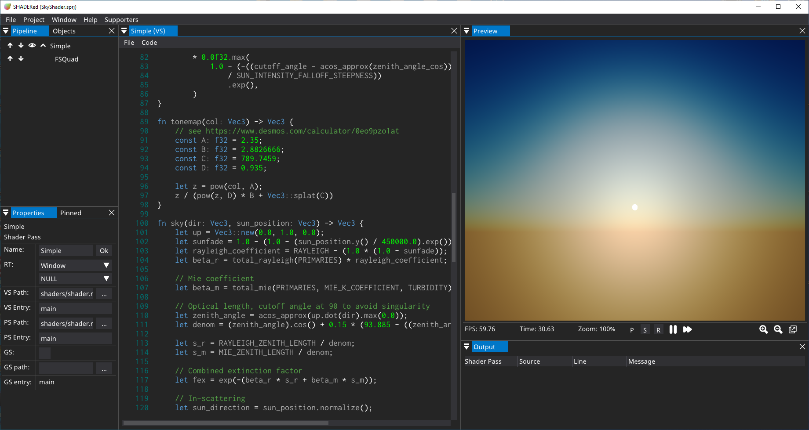
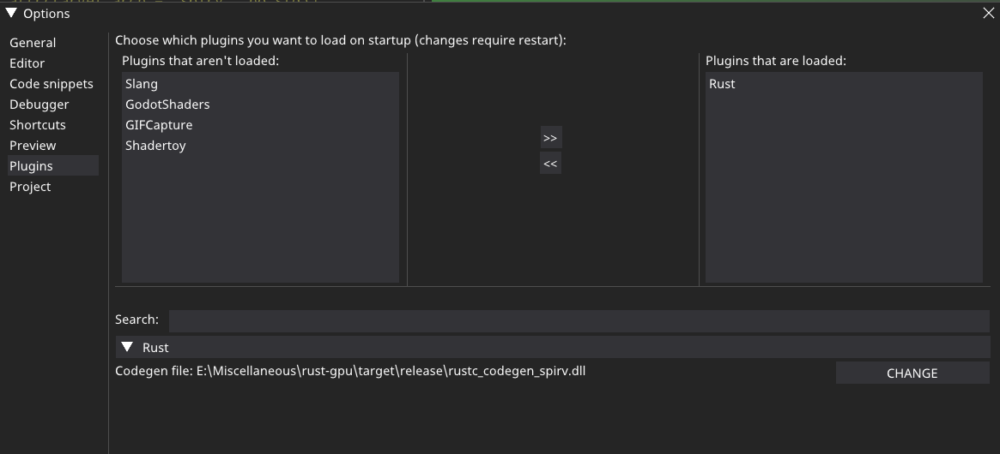
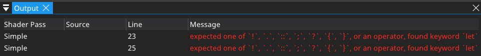

# PluginRust
SHADERed plugin that lets you write your shaders in Rust. This is possible thanks to the [rust-gpu](https://github.com/EmbarkStudios/rust-gpu) project.



You can change path to your `rustc_codegen_spriv.dll` in the options:



## How to build
Run the following commands:
```bash
git clone https://github.com/dfranx/PluginRust.git
cmake .
make
```

## Known bugs & problems
**NOTE:** You have to turn off the "Recompile shader on content change" option since build times are relatively long.

Currently errors don't point to shader stage/source:


## How to use
This plugin requires at least SHADERed v1.4.

Copy the .dll/.so file to `plugins/Rust` folder in your SHADERed's installation directory

After you start SHADERed, you can open one of the provided projects to quickly get started.

Also, make sure you have `cargo` installed on your PC.
